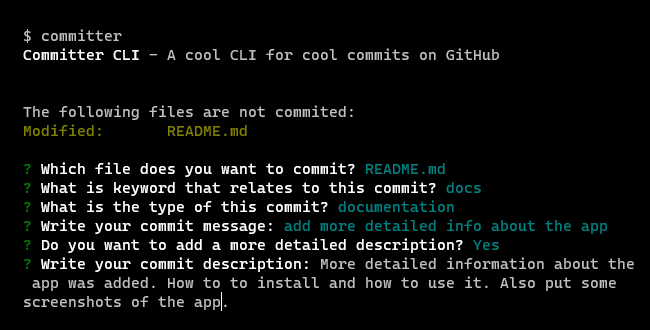

<div align="center">
	

    When you use Committer, things get easy and prettier!
    See down below how to install and use Committer to make cool (and understandable) commits in your GitHub repository.

</div>

# Instalation

You can install Committer using the most common package managers for node.js

```bash
# installation with npm

$ npm i -g committer-cli


# installation with yarn

$ yarn global add committer-cli


# installation with pnpm

$ pnpm install -g committer-cli
```

# Using the command line tool

Just type `committer` or `cmt` instead of using `git commit` every time you need to commit some file. You can also type `git-cmt`, as an alias for `committer`.

Select the files you want to commit:


Select the keyword that relates to your commit.


Specify what type of changes were made in the selected files:<br/>

Note: for each different keyword you choose, you will have differents items in this list.

Type a short message for your commit (it's highly recommended a message with more than 4 words)


Whether you want, you can add a more detailed description talking about the changes that were made.

Note: the option for add a more detailed description is "No" for default.

And finnaly, commit changes to the default branch

<!--  -->

Or a custom branch

<!--  -->

# Author

[@suicxyz](https://github.com/suicxyz)<br/>
[Package in NPM](https://npmjs.com/pacakge/committer-cli)<br/>
[Repository in GitHub](https://github.com/suicxyz/committer-cli)
